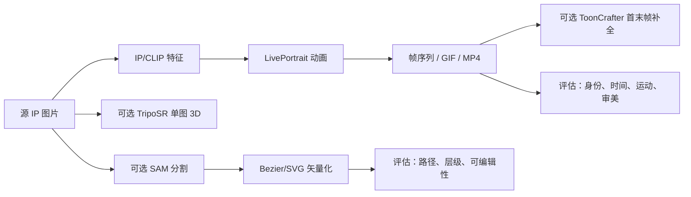
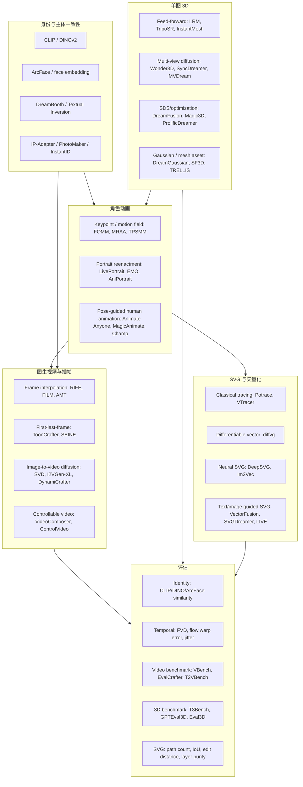

# emoSVG 工作流全面前沿文献综述（扩展版）

生成日期：2026-05-10  
定位：本文件是 `docs/frontier_research_report.md` 的扩展文献综述版。前一份报告更偏项目评估与路线图，本文件更偏“论文/开源项目技术地图 + 可迁移启示 + 全面文献池”。

## 0. 摘要结论

emoSVG 当前工作流本质上位于多个研究方向的交叉处：

1. **单图角色动画 / 表情迁移**：把静态 IP 形象变成可动角色，核心挑战是身份一致性、局部表情合理性、姿态/驱动可控性。
2. **首末帧 / 图生视频 / 卡通插帧**：把关键帧或静态图扩展成短视频，核心挑战是运动合理性、时间一致性、卡通风格保持。
3. **单图 3D / 3D-aware 资产生成**：为角色提供视角变化、深度、几何代理或后续动画基础，核心挑战是后视图幻想、纹理一致性、拓扑可编辑性。
4. **SVG 矢量化 / 可编辑图形生成**：把栅格输出转成可编辑、可压缩、可风格化的矢量资产，核心挑战是语义分层、路径数量控制、颜色/边界质量。
5. **生成式评估 benchmark**：把“看起来不错”变成可回归的指标体系，核心挑战是审美、身份、运动、可编辑性和工程成本之间的权衡。

对本 repo 的直接判断：

- **emoSVG 的正确路线不是重写一个大模型**，而是把成熟研究成果封装成可替换 backend，并建立项目自己的小型、稳定、可复现实验集。
- 当前最值得优先补齐的是：`LivePortrait/ToonCrafter` 真实接线验证、首末帧/驱动帧参数贯通、身份一致性指标、时间一致性指标、SVG 可编辑性指标。
- 单图 3D 与 SVG 不应急于追求“最强生成效果”，应先定义资产用途：预览、表情辅助、视角补全、可编辑矢量交付，对应的评估标准完全不同。
- 前沿研究对 emoSVG 的最大启示是：**把生成任务拆成可观测阶段**。每阶段都要有输入、输出、失败类型、自动指标和人工评分表。

## 1. 本项目现状映射

根据 `docs/architecture.md` 与当前代码结构，emoSVG 已经形成了一个多阶段资产生成 pipeline：



当前架构优点：

- 已经有 `ModelRegistry`、VRAM 估算、CPU fallback、API/service 分层，适合把研究模型做成可插拔 backend。
- 已经覆盖动画、3D、分割、SVG 的全链路雏形，方向是对的。
- 测试已有 fallback/mocking 思路，适合继续扩展为 smoke benchmark 与质量回归。

当前主要短板：

- `AnimationRequest` 中已有 `use_toon_crafter_as_driver` 和 `driver_num_frames`，但高层 API 与完整 pipeline 尚未完整暴露和贯通。
- `ToonCrafterWrapper` 的真实导入/适配风险较高，需要先做最小真实样例验证。
- `ip_adapter_embeds` 接入 LivePortrait 的有效性需要实测，不能只依赖接口存在。
- 当前测试更偏“能跑通/文件存在”，缺少身份一致性、时间一致性、运动幅度、SVG 可编辑性等质量指标。
- 文档中的 SAM VRAM 估计与代码常量存在差异，后续评估应同时记录峰值显存与实际耗时。

## 2. 文献优先级分层

为了避免论文堆叠，本综述把论文/项目分成四层。

**S 层：直接影响下一轮实现**

- LivePortrait、First Order Motion Model、TPSMM/MRAA
- ToonCrafter、DynamiCrafter、SEINE、FILM/AMT/RIFE
- SAM/SAM2、Grounding DINO、Mask2Former
- diffvg、Im2Vec、VectorFusion、SVGDreamer、Layered Image Vectorization
- VBench、EvalCrafter、FVD、LPIPS、DOVER、T3Bench/GPTEval3D

**A 层：适合作为中期 backend 候选**

- Animate Anyone、MagicAnimate、Champ、AniPortrait、EMO
- I2VGen-XL、VideoComposer、ControlVideo/Control-A-Video、Stable Video Diffusion
- TripoSR、LRM、InstantMesh、CRM、Wonder3D、Unique3D、DreamGaussian、SF3D
- Grounded-SAM、XMem、SegGPT

**B 层：提供长期方向或评估思想**

- DreamBooth、Textual Inversion、IP-Adapter、InstantID、PhotoMaker、ELITE
- DreamFusion、Magic3D、Fantasia3D、ProlificDreamer、MVDream、SyncDreamer
- DeepSVG、CLIPDraw、DiffSketcher
- VideoScore、T2VBench、VBench++、3DGen-Bench、GenesisEval

**观察层：工程前沿，效果强但需谨慎接入**

- Wan2.x、LTX-Video、HunyuanVideo、Hunyuan3D、TRELLIS、MeshAnything 等。
- 这类项目往往工程价值很高，但论文同行评审、许可证、推理成本和本地部署复杂度要单独确认。

## 3. 技术地图



## 4. 角色动画与运动迁移

### 4.1 经典图像动画与关键点驱动

| 论文/项目 | 年份/来源 | 核心思想 | 对 emoSVG 的启示 | 优先级 |
|---|---:|---|---|---|
| Monkey-Net / Animating Arbitrary Objects via Deep Motion Transfer | ICCV 2019 | 从驱动视频中学习运动，把任意对象动画化 | 是 FOMM 前的重要铺垫，说明“对象无关运动迁移”可行，但稳定性有限 | B |
| First Order Motion Model (FOMM) | NeurIPS 2019 | 无监督关键点 + 局部仿射运动场 | 可作为最小 baseline：身份保持、运动迁移、低成本评估 | S |
| Motion Representations for Articulated Animation (MRAA) | CVPR 2021 | 针对 articulated object 的运动表示 | 对非人脸卡通角色更相关，适合做对照 backend | A |
| Thin-Plate Spline Motion Model (TPSMM) | CVPR 2022 | 用 TPS 变换增强复杂形变建模 | 对夸张表情、非刚性卡通轮廓有价值 | S |
| DaGAN / Depth-Aware Talking Head | CVPR 2022 | 引入深度感知改善 talking head 生成 | 对头像类 IP 有参考意义，但泛化到卡通需验证 | B |

可落地启示：

- emoSVG 应保留一个**轻量 motion-transfer baseline**，哪怕效果不如 LivePortrait，也能作为质量回归基线。
- 对卡通 IP，关键问题不是“真实人脸重演”，而是**局部形变是否保留角色设计**，因此 TPS/MMRAA 类方法的思想比纯 talking-head 更适合做对照。
- 评估时应区分三类输入：真人头像、类人卡通头像、非人形角色。不同类别的运动失败模式完全不同。

### 4.2 人像、表情与 talking head reenactment

| 论文/项目 | 年份/来源 | 核心思想 | 对 emoSVG 的启示 | 优先级 |
|---|---:|---|---|---|
| LivePortrait | 2024 开源项目/论文 | 高效人像动画，强调 controllability 与实时性 | 当前 repo 的核心动画 backend，必须先验证真实链路和参数 | S |
| AniPortrait | 2024 | 音频/姿态驱动的高质量人像动画 | 可作为口型/表情驱动扩展参考 | A |
| EMO: Emote Portrait Alive | 2024 | 音频到表情/头部运动的 expressive portrait video | 对“情绪 SVG”命名目标高度相关，但部署成本较高 | A |
| SadTalker | 2023 | 音频驱动 talking head 工程系统 | 适合作为 audio-driven baseline，不是最终主线 | B |
| MakeItTalk / Wav2Lip 系列 | 2019-2020 | 音频-口型同步 | 如未来扩展配音表情，可作为口型指标来源 | B |

可落地启示：

- 当前阶段不要急着扩音频驱动，应先把**静态图 + 表情/姿态驱动**跑稳。
- 对 LivePortrait，要增加真实样例测试：输入固定 IP 图、固定 driving video、固定输出帧数，记录 identity similarity、mouth/eye landmark movement、temporal jitter。
- 如果 emoSVG 未来走“情绪表达”方向，EMO/AniPortrait 的价值在于表情强度与音频同步，但它们不直接解决 SVG 可编辑问题。

### 4.3 人体/角色姿态驱动动画

| 论文/项目 | 年份/来源 | 核心思想 | 对 emoSVG 的启示 | 优先级 |
|---|---:|---|---|---|
| Animate Anyone | 2023/2024 | ReferenceNet + pose guider 保持人物一致性 | 如果 emoSVG 从头像走向全身 IP，这是关键参考 | A |
| MagicAnimate | 2023 | 扩散模型 + dense pose 控制 | 可用于全身角色动作迁移评估 | A |
| Champ | 2024 | 多条件人体动画，关注 3D/pose/shape 一致性 | 提醒 emoSVG 未来应保留 pose/depth/normal 条件接口 | A |
| DreamPose | 2023 | 单图人物姿态视频合成 | 适合做早期全身动画候选 | B |
| HumanSD / ControlNet-pose 系列 | 2023-2024 | 姿态条件生成 | 作为通用 pose control 参考 | B |

可落地启示：

- `AnimationRequest` 建议从现在开始预留 `driver_type`：`video`、`expression`、`pose`、`audio`、`first_last_frame`。
- 角色动画 backend 不应绑定某个模型的参数名，应抽象成：source image、driver signal、identity reference、motion strength、frame count、output fps。
- 如果将来支持全身 IP，SVG 矢量化要能处理多部件层级，而不是只输出单一轮廓。

## 5. 图生视频、首末帧视频与卡通插帧

### 5.1 通用视频插帧

| 论文/项目 | 年份/来源 | 核心思想 | 对 emoSVG 的启示 | 优先级 |
|---|---:|---|---|---|
| Super SloMo | CVPR 2018 | 光流估计 + 中间帧合成 | 经典 baseline，适合低成本质量对照 | B |
| DAIN | CVPR 2019 | Depth-aware video frame interpolation | 对遮挡关系有帮助，但工程较旧 | B |
| RIFE | 2020-2022 开源/论文 | 实时中间流估计，高速插帧 | 可作为轻量插帧 backend，适合本地部署 | S |
| FILM | ECCV 2022 | 面向大运动的帧插值 | 对首末帧差异较大时更稳 | S |
| AMT | CVPR 2023 | All-pairs multi-field transforms | 高质量插帧候选，可作为评估上限 | S |

可落地启示：

- ToonCrafter 是卡通首末帧补全，但 emoSVG 仍需要一个普通插帧 baseline：RIFE/FILM/AMT。
- 对生成动画，插帧不是越多越好。应评估 motion smoothness 与 identity drift 的 trade-off。
- 应加入“闭环测试”：原始第 0 帧和末帧固定，生成中间帧后检查中间帧是否偏离角色设计。

### 5.2 卡通插帧与首末帧视频生成

| 论文/项目 | 年份/来源 | 核心思想 | 对 emoSVG 的启示 | 优先级 |
|---|---:|---|---|---|
| ToonCrafter | ACM TOG / SIGGRAPH 2024 | 面向卡通的首末帧插帧与运动补全 | 与 emoSVG 当前 `use_toon_crafter_as_driver` 最直接相关 | S |
| SEINE | ICLR 2024 | 短到长视频扩散、支持图像/视频补全与过渡 | 可作为首末帧视频生成的强候选 | S |
| DynamiCrafter | ECCV 2024 | open-domain image animation，利用图像条件扩散 | 适合从静态 IP 生成自然短动画 | S |
| Stable Video Diffusion | 2023/2024 | 图生视频基础模型 | 工程成熟，适合做 baseline，但卡通一致性需测 | A |
| ConsistI2V | 2024 | 提升图生视频首帧/主体一致性 | 对 identity drift 评估和模型选择有启发 | A |

可落地启示：

- 当前代码里“用 ToonCrafter 作为 LivePortrait driving video”的想法合理，但需要明确定义两种模式：
  - `transition_mode`：给首末关键帧，生成过渡视频。
  - `driver_mode`：把生成视频再喂给 LivePortrait 作为驱动信号。
- 对卡通 IP，首末帧视频更适合生成“动作过渡”，LivePortrait 更适合生成“表情/头部运动”。二者不要混成一个不可解释黑箱。
- `driver_num_frames`、fps、motion strength、首末帧选择策略要进入 API schema，而不是只停留在内部 request。

### 5.3 可控视频扩散

| 论文/项目 | 年份/来源 | 核心思想 | 对 emoSVG 的启示 | 优先级 |
|---|---:|---|---|---|
| VideoComposer | NeurIPS 2023 | 组合文本、草图、深度、运动等条件进行视频生成 | 说明 emoSVG 应预留多条件控制接口 | A |
| Control-A-Video / ControlVideo | 2023-2024 | 把 ControlNet 思想扩展到视频 | 可作为 pose/depth/edge 条件视频 backend 方向 | A |
| I2VGen-XL | 2023/2024 | 高质量图生视频大模型 | 适合做质量上限参考，不一定本地优先 | A |
| VideoCrafter 系列 | 2023-2024 | 开源 T2V/I2V diffusion 框架 | 工程参考价值高 | B |
| AnimateDiff | 2023 | motion module 插件化 | 适合研究“动画能力作为模块”这一架构思路 | B |

可落地启示：

- 对 emoSVG 更重要的是**控制信号的统一表示**，不是锁定某个视频大模型。
- 建议新增 `VideoGenerationBackend` 抽象，最少支持：`source_image`、`prompt`、`negative_prompt`、`control_images`、`first_frame`、`last_frame`、`num_frames`、`fps`、`seed`。
- 对所有视频 backend，输出都应附带 metadata：模型名、版本、seed、帧数、分辨率、耗时、显存峰值、失败/降级原因。

## 6. 身份一致性与主体定制

| 论文/项目 | 年份/来源 | 核心思想 | 对 emoSVG 的启示 | 优先级 |
|---|---:|---|---|---|
| CLIP | ICML 2021 | 图文对齐表示 | 当前可用于粗粒度语义一致性，不足以保证角色身份 | S |
| DINOv2 | 2023 | 自监督视觉特征，迁移性强 | 可用于非真人/卡通主体相似度，比 ArcFace 更泛化 | S |
| ArcFace | CVPR 2019 | 人脸识别 embedding | 真人/类人头像身份指标有效，但不适合非人形 IP | A |
| Textual Inversion | ICLR 2023 | 用少量图学习新概念 token | 主体定制思想参考，训练成本低但表达有限 | B |
| DreamBooth | CVPR 2023 | 少样本主体定制扩散模型 | 对高一致性角色生成重要，但训练型流程较重 | B |
| IP-Adapter | 2023 | 解耦图像提示适配器 | 与当前 IP feature/conditioning 思路最贴近 | S |
| ELITE | ICCV 2023 | 编码器式主体定制 | 提醒项目可探索免训练主体注入 | B |
| PhotoMaker | 2024 | 以身份 embedding 支持个性化生成 | 真人身份方向参考 | B |
| InstantID | 2024 | identity preserving diffusion | 对人脸身份保持很强，卡通适用性待测 | B |
| VideoBooth / DreamVideo / CustomVideo | 2023-2024 | 主体一致视频生成 | 对“同一 IP 多动作视频”有长期意义 | A |

可落地启示：

- emoSVG 应该同时使用三类 identity 指标：
  - CLIP/DINOv2：卡通和通用主体相似度。
  - ArcFace：真人/人脸子集。
  - 分割后主体颜色/轮廓统计：SVG/卡通特别重要。
- 对非人形角色，身份一致性更像“轮廓 + 主色 + 局部符号”的组合，不应只用人脸指标。
- 如果将来接入主体定制视频模型，要先用小型 curated set 评估 identity drift，再考虑生产化。

## 7. 分割、检测与视频对象跟踪

| 论文/项目 | 年份/来源 | 核心思想 | 对 emoSVG 的启示 | 优先级 |
|---|---:|---|---|---|
| Mask R-CNN | ICCV 2017 | 实例分割经典框架 | 作为历史 baseline，不建议新接入 | B |
| DETR / Deformable DETR | ECCV 2020 / ICLR 2021 | transformer 检测范式 | 对 open-vocabulary 前置理解有参考 | B |
| Mask2Former | CVPR 2022 | 统一语义/实例/全景分割 | 若需要语义层级 SVG，可作为强分割候选 | S |
| SAM | ICCV 2023 | promptable segmentation foundation model | 当前 repo 已接入，适合交互式/自动主体 mask | S |
| SAM2 | 2024 | 图像与视频统一分割/跟踪 | 对动画帧一致 mask 极有价值 | S |
| Grounding DINO | ECCV 2024 / 开源 | open-set phrase grounding | 可与 SAM 组合，自动定位“角色/头/眼睛/嘴” | A |
| Grounded-SAM | 2023-2024 开源组合 | 文本检测 + SAM 分割 | 适合从 prompt 到局部 SVG 层级 | A |
| XMem | ECCV 2022 | 长视频对象分割记忆机制 | 对动画帧 mask 一致性有参考 | A |
| SegGPT | ICCV 2023 | in-context segmentation | 对少样本风格化分割有研究价值 | B |
| CutLER | CVPR 2023 | 无监督对象发现与实例分割 | 对无标注角色主体发现有启发 | B |

可落地启示：

- SVG 矢量化前的 mask 质量决定后续路径质量。建议先做 mask benchmark：主体 IoU、边界 F-score、孔洞/碎片数量。
- SAM2 对 emoSVG 可能比单帧 SAM 更重要：动画帧逐帧矢量化时，时间一致 mask 能减少 SVG 闪烁。
- Grounding DINO + SAM 可用于“语义分层”：身体、眼睛、嘴、头发、衣服分别矢量化，比单一轮廓更接近可编辑资产。

## 8. 单图 3D 与 3D-aware 资产生成

### 8.1 Feed-forward 单图 3D

| 论文/项目 | 年份/来源 | 核心思想 | 对 emoSVG 的启示 | 优先级 |
|---|---:|---|---|---|
| PixelNeRF | CVPR 2021 | 从图像特征预测 NeRF | 单图/少图 3D 的早期重要路线 | B |
| Zero-1-to-3 | ICCV 2023 | 视角条件扩散，单图新视角合成 | 可用于生成多视图再重建 | A |
| LRM | 2023 | 大规模单图到 radiance field 前馈重建 | TripoSR 等方法的关键思想来源 | S |
| TripoSR | 2024 | 高速单图 3D 重建 | 当前 repo 已有 backend，优先做稳定评估 | S |
| InstantMesh | 2024 | 单图到 mesh 的高效生成 | 若需要 mesh 交付，可作为 TripoSR 后续候选 | A |
| CRM | 2024 | 单图到 3D textured mesh | 适合资产化路线评估 | A |
| Unique3D | 2024 | 高质量单图 3D mesh 生成 | 可作为高质量候选，需评估部署成本 | A |
| SF3D / Stable Fast 3D | 2024 | 快速单图 3D asset 生成 | 工程可用性强，适合观察 | A |

可落地启示：

- emoSVG 需要先明确 3D 的用途：
  - 如果只是辅助动画，深度/法线/粗 mesh 即可。
  - 如果要资产交付，需要拓扑、UV、纹理、可编辑性指标。
  - 如果要辅助 SVG，多视角边界和语义层级比高保真 mesh 更重要。
- TripoSR 评估应加入：前视一致性、多视图 identity、mesh watertightness、纹理破碎、推理耗时。

### 8.2 多视图扩散与 3D 一致性

| 论文/项目 | 年份/来源 | 核心思想 | 对 emoSVG 的启示 | 优先级 |
|---|---:|---|---|---|
| SyncDreamer | ICLR 2024 | 同步生成多视图以保持 3D 一致性 | 对单图卡通角色补后视图有价值 | A |
| Wonder3D | CVPR 2024 | 单图生成多视角 normal/color | 可为 3D 重建提供更稳输入 | A |
| MVDream | ICLR 2024 | 多视图扩散用于 3D generation | 对 text/image-to-3D pipeline 有参考 | B |
| ImageDream | 2023/2024 | 图像条件多视图生成 | 对 IP 形象视角补全有启发 | B |
| Zero123++ | 2023/2024 | 更强的新视角生成 | 作为多视图预处理候选 | A |

可落地启示：

- 单图 3D 的失败常来自不可见背面幻想。多视图扩散可以把问题显性化：生成的背面是否符合角色设定？
- 对品牌/IP 资产，背面乱编可能比低保真更危险。应把“不可见区域置信度”写入 metadata。
- 若接入多视图模型，SVG 侧可扩展为“多视图 SVG sprite/turnaround sheet”。

### 8.3 SDS、Gaussian 与文本/图像到 3D

| 论文/项目 | 年份/来源 | 核心思想 | 对 emoSVG 的启示 | 优先级 |
|---|---:|---|---|---|
| DreamFusion | ICLR 2023 | Score Distillation Sampling，把 2D diffusion 蒸馏到 3D | 奠定 text-to-3D 范式，工程成本较高 | B |
| Magic3D | CVPR 2023 | coarse-to-fine 高分辨率 text-to-3D | 高质量 3D 生成参考 | B |
| Fantasia3D | ICCV 2023 | 解耦几何与外观 | 对资产可编辑性有启发 | B |
| ProlificDreamer | NeurIPS 2023 | Variational Score Distillation | 提升多样性与质量 | B |
| DreamGaussian | ICLR 2024 | 3D Gaussian 加速 text/image-to-3D | 快速优化式路线参考 | A |
| GaussianDreamer | CVPR 2024 | 3D Gaussian text-to-3D | 对实时预览和快速迭代有参考 | B |
| TRELLIS | 2024/2025 | 大规模 3D asset 生成框架 | 工程前沿，需评估许可证/成本 | 观察 |
| Hunyuan3D | 2025/2026 | 开源 3D 生成系统 | 工程前沿，适合后续调研 | 观察 |

可落地启示：

- 对 emoSVG，SDS 类优化方法更适合离线高质量生成，不适合默认交互路径。
- Gaussian 表示适合快速预览，但最终交付若是 SVG/mesh，还需要转换与质量控制。
- 3D 研究的共同启示是：要记录相机、尺度、坐标系和材质假设，否则后续动画/矢量化很难复现。

## 9. SVG 矢量化与可编辑图形生成

### 9.1 传统 tracing 与工程基线

| 项目 | 类型 | 核心思想 | 对 emoSVG 的启示 | 优先级 |
|---|---|---|---|---|
| Potrace | 传统矢量化 | bitmap tracing，输出路径 | 强 baseline，适合黑白/轮廓资产 | S |
| VTracer | 工程开源 | 彩色图像到 SVG，基于区域/路径追踪 | 当前工程最实用候选之一 | S |
| OpenCV contour + Bézier fitting | 工程方案 | mask 轮廓提取后拟合曲线 | 当前 repo 思路，可控但语义弱 | S |

可落地启示：

- 传统 tracing 不“前沿”，但对生产 SVG 很重要。它们应作为低成本、可解释、可回归 baseline。
- 评估 SVG 不应只看图像重建误差，还要看路径数、节点数、层级、颜色数量、是否容易编辑。

### 9.2 可微矢量图形与神经 SVG

| 论文/项目 | 年份/来源 | 核心思想 | 对 emoSVG 的启示 | 优先级 |
|---|---:|---|---|---|
| diffvg | SIGGRAPH Asia 2020 | differentiable rasterizer for vector graphics | 可用于通过图像损失优化 SVG 路径 | S |
| DeepSVG | NeurIPS 2020 | SVG path 的层级生成模型 | 对 SVG 结构建模有启发 | B |
| Im2Vec | CVPR 2021 | 无需矢量监督的图像到矢量生成 | 与 emoSVG 的 raster-to-vector 目标接近 | S |
| CLIPDraw | 2021 | CLIP 引导的矢量绘制 | 对文本/语义约束 SVG 有启发 | B |
| DiffSketcher | SIGGRAPH/TOG 2023 | 文本引导矢量素描合成 | 适合 sketch 风格方向 | B |
| VectorFusion | CVPR 2023 | text-to-SVG via diffusion/CLIP guidance | 可作为生成式 SVG 方向重要参考 | S |
| SVGDreamer | 2023/2024 | 文本到高质量 SVG 生成 | 对可编辑生成式 SVG 有参考 | A |
| Layered Image Vectorization / LIVE | 2025 | 语义简化的分层图像矢量化 | 对 emoSVG 最关键：从单轮廓走向语义层级 | S |
| BézierSketch / line drawing vectorization | 2020-2024 | 线稿到 Bézier 曲线 | 对卡通线稿、表情线条特别相关 | A |

可落地启示：

- SVG 方向的关键不是“能不能输出 svg 文件”，而是**输出是否是设计师可编辑的层级图形**。
- 建议把 SVG backend 分成三类：
  - `TraceBackend`：VTracer/Potrace/OpenCV，重建稳定。
  - `OptimizeBackend`：diffvg，图像损失可优化。
  - `SemanticVectorBackend`：SAM/GroundingDINO/LIVE 类，追求层级和可编辑性。
- 对动画输出，逐帧 SVG 会产生路径闪烁。更好的长期目标是：固定拓扑路径 + 时间参数化控制点。

### 9.3 SVG 评估指标

建议建立以下 SVG 指标：

| 指标 | 说明 | 推荐用途 |
|---|---|---|
| Raster LPIPS / SSIM / PSNR | SVG rasterize 后与原图比较 | 重建质量 |
| Mask IoU / Boundary F-score | SVG 主体轮廓与 mask 比较 | 轮廓质量 |
| Path count / node count | 路径与控制点数量 | 可编辑性、文件大小 |
| Color count / palette entropy | 颜色数量与分布 | 风格简洁度 |
| Layer purity | 单层是否对应语义部件 | 设计可编辑性 |
| Temporal path consistency | 相邻帧路径数量/拓扑/控制点变化 | 动画 SVG 防闪烁 |
| Human edit score | 人工评估能否快速改色、改眼睛、改嘴型 | 产品真实价值 |

## 10. 生成式评估 Benchmark 与指标体系

### 10.1 视频生成评估

| Benchmark/指标 | 年份/来源 | 评估内容 | 对 emoSVG 的启示 | 优先级 |
|---|---:|---|---|---|
| FVD | 2019 | 视频分布距离 | 常用但需要足够样本，单项目小集不稳定 | S |
| LPIPS | CVPR 2018 | 感知相似度 | 适合 identity/frame reconstruction 辅助 | S |
| Optical flow warp error | 经典指标 | 相邻帧运动一致性 | 适合小型回归测试 | S |
| DOVER | 2023 | 无参考视频质量/审美 | 可作为视频自然度辅助评分 | A |
| VBench | CVPR 2024 | 多维度视频生成 benchmark | 可借鉴维度拆分：subject、motion、temporal、aesthetic | S |
| EvalCrafter | CVPR 2024 | 视频生成自动评估工具箱 | 可参考其综合维度设计 | S |
| T2VBench | 2024 | 文本到视频评估 | 如果 emoSVG 加 prompt control，可借鉴 | B |
| VideoScore | 2024/2025 | 模拟细粒度人类反馈 | 对人工评分表设计有参考 | B |
| VBench++ | 2025 | 扩展视频评估维度 | 长期观察 | B |

可落地启示：

- emoSVG 不应该直接照搬完整 VBench，而是抽取适合项目的小集：
  - identity preservation
  - temporal flicker
  - motion controllability
  - cartoon style preservation
  - artifact rate
- 由于样本量小，FVD 更适合作为长期趋势指标，不适合作为单次 PR 阻断指标。
- 对 PR/CI 更实用的是固定输入下的 CLIP/DINO 相似度、flow jitter、文件尺寸、耗时、显存、失败率。

### 10.2 图像/主体一致性评估

| 指标/模型 | 适用对象 | 风险 |
|---|---|---|
| CLIP image similarity | 通用主体/风格 | 对细节身份不敏感 |
| DINOv2 feature similarity | 非人脸、卡通、纹理 | 需要选择层和 pooling 策略 |
| ArcFace similarity | 真人/类人头像 | 对非人形角色无效 |
| Color histogram / palette distance | 卡通 IP | 容易被背景干扰，需先分割 |
| Shape descriptor / contour IoU | SVG/卡通轮廓 | 对姿态变化敏感 |
| Landmark distance | 人脸/头像 | 卡通 landmark 检测可能失败 |

建议：

- 对每个样本标注 `subject_type`：`human_face`、`cartoon_face`、`full_body_character`、`non_human_mascot`、`object_icon`。
- 每类样本采用不同指标组合，避免“用人脸指标评估非人脸角色”。

### 10.3 3D 生成评估

| Benchmark/指标 | 年份/来源 | 评估内容 | 对 emoSVG 的启示 | 优先级 |
|---|---:|---|---|---|
| Chamfer Distance / F-score | 经典 3D 指标 | 需要 GT mesh | 对真实 benchmark 有用，本项目样本可能缺 GT | B |
| CLIP-R-Precision / CLIP similarity | 文本/图像一致性 | 适合无 GT 粗评 | A |
| Multi-view consistency | 3D/多视图 | 前后视角身份一致 | S |
| GPTEval3D | 2024 | 多维 3D 生成评估 | 可借鉴人类偏好维度 | B |
| Eval3D | 2024 | 3D 生成评估框架 | 参考指标组织方式 | B |
| T3Bench | CVPR 2024 | text-to-3D benchmark | 若扩展 prompt-to-3D 可参考 | B |
| 3DGen-Bench / GenesisEval | 2024 | 3D 生成综合评估 | 长期观察 | B |

对 TripoSR/单图 3D 的本地指标：

- 输入视角重投影相似度。
- 多视角渲染的主体完整性。
- mesh 面数、非流形边、孤立组件数量。
- 纹理 UV 缺失率。
- 推理时间和峰值显存。
- 人工评分：像不像原 IP、背面是否合理、是否可用于后续动画。

## 11. 与 emoSVG 的差距总表

| 方向 | 前沿研究状态 | emoSVG 当前状态 | 主要差距 | 建议动作 |
|---|---|---|---|---|
| 单图表情动画 | LivePortrait/EMO 等已有强模型 | 已接 LivePortrait wrapper | 真实接线、参数、指标未闭环 | 做固定样例 smoke + 指标 |
| 卡通首末帧 | ToonCrafter/SEINE/DynamiCrafter 成熟度提升 | 有 ToonCrafter wrapper 雏形 | API 未贯通，真实导入风险 | P0 修通最小样例 |
| 通用插帧 | RIFE/FILM/AMT 工程成熟 | 暂未作为独立 baseline | 缺低成本 baseline | 加 `InterpolationBackend` |
| 主体一致性 | IP-Adapter/DINO/ArcFace 指标丰富 | 有 CLIP/IP 特征意图 | 指标体系不完整 | 加 DINO/ArcFace/颜色/轮廓组合 |
| 单图 3D | LRM/TripoSR/InstantMesh 快速发展 | 已有 TripoSR | 用途与评估未定义清楚 | 明确 3D 是预览/辅助/交付 |
| SVG 矢量化 | diffvg/Im2Vec/VectorFusion/LIVE 多路线 | SAM + Bézier 雏形 | 缺语义分层与可编辑指标 | 加 tracing baseline + SVG 指标 |
| 视频评估 | VBench/EvalCrafter/T2VBench 成熟 | 测试偏文件存在 | 缺质量回归 | 建小型 emoSVG benchmark |
| 工程 MLOps | 研究模型繁多 | 有 registry/VRAM 设计 | 缺模型版本与输出 metadata | 输出 provenance JSON |

## 12. 可落地架构建议

### 12.1 Backend 抽象

建议新增或明确以下接口：

```text
IdentityEncoderBackend
  encode(image) -> identity_embedding, semantic_embedding, metadata

MotionAnimationBackend
  animate(source_image, driver, options) -> frames, metadata

VideoTransitionBackend
  transition(first_frame, last_frame, options) -> frames, metadata

FrameInterpolationBackend
  interpolate(frames, multiplier, options) -> frames, metadata

Reconstruction3DBackend
  reconstruct(image, options) -> mesh/gaussian/preview, metadata

SegmentationBackend
  segment(image_or_frames, prompts, options) -> masks, metadata

VectorizationBackend
  vectorize(image, masks, options) -> svg, metadata

EvaluationBackend
  evaluate(inputs, outputs, task_type) -> metrics, report
```

这样每个研究成果都只是 backend 选择，不会污染核心 pipeline。

### 12.2 输出 metadata 标准

每次生成建议保存：

```json
{
  "pipeline_version": "emoSVG",
  "model_backends": {
    "animation": "LivePortrait",
    "transition": "ToonCrafter",
    "vectorization": "SAM+Bézier"
  },
  "inputs": {
    "source_image_sha256": "...",
    "driver_sha256": "...",
    "prompt": "..."
  },
  "runtime": {
    "device": "cuda",
    "duration_sec": 0,
    "peak_vram_gb": 0
  },
  "generation": {
    "seed": 0,
    "fps": 24,
    "num_frames": 32,
    "resolution": [512, 512]
  },
  "metrics": {
    "identity_dino": 0,
    "temporal_warp_error": 0,
    "svg_path_count": 0
  }
}
```

### 12.3 评估集设计

建议建立 `benchmarks/emosvg_core/`：

| 子集 | 样本数 | 目的 |
|---|---:|---|
| 真人头像 | 5-10 | ArcFace/LivePortrait sanity |
| 类人卡通头像 | 10-20 | 表情迁移与风格保持 |
| 全身卡通角色 | 10-20 | 姿态/轮廓/分割 |
| 非人形吉祥物 | 10-20 | DINO/轮廓/颜色指标 |
| 图标/扁平插画 | 10-20 | SVG 矢量化可编辑性 |

每个样本保存：

- 原图。
- 可选 mask。
- 可选 driving video / expression preset。
- 期望输出类型。
- 失败备注。
- 人工评分基准。

## 13. 优先级路线图（扩展版）

### P0：先让当前想法变成可验证系统

1. 贯通 `use_toon_crafter_as_driver` 与 `driver_num_frames` 到 `/animate`、`/generate`、`FullPipelineRequest`。
2. 为 LivePortrait + ToonCrafter 做最小真实样例测试。
3. 记录每次输出的 metadata：backend、seed、帧数、fps、耗时、显存、输入 hash。
4. 建立 10-20 个样本的 `emosvg_smoke_benchmark`。
5. 加入基础指标：DINO/CLIP 相似度、相邻帧 LPIPS/flow jitter、SVG path count、文件大小。

### P1：把效果从“能跑”推进到“可比较”

1. 接入 RIFE/FILM/AMT 之一作为 frame interpolation baseline。
2. 为 ToonCrafter、LivePortrait、baseline 插帧生成统一对比表。
3. 增加 SAM/SAM2 mask 质量测试。
4. SVG 增加 VTracer/Potrace/OpenCV Bézier 三种 baseline 对比。
5. 输出 HTML/Markdown benchmark report，包含缩略图、GIF、指标表、人工评分入口。

### P2：引入中期高价值模型

1. 评估 DynamiCrafter 或 SEINE 作为 open-domain I2V/FLF backend。
2. 评估 InstantMesh/SF3D 作为 TripoSR 替代或补充。
3. 探索 GroundingDINO + SAM 的语义分层矢量化。
4. 增加固定拓扑 SVG 动画原型：同一组路径控制点随时间变化。

### P3：研究型扩展

1. 主体一致视频生成：VideoBooth/DreamVideo/CustomVideo 类方向。
2. 3D-aware 动画：用 depth/normal/mesh 辅助表情和视角变化。
3. 可编辑 SVG 生成：diffvg + semantic masks + style constraints。
4. 训练或微调小模型：只在评估证明 wrapper 路线不足时再做。

## 14. 推荐必读论文/项目清单

### 14.1 第一批：直接服务当前迭代

1. FOMM：理解 image animation baseline。
2. TPSMM：理解卡通/非刚性形变的运动迁移。
3. LivePortrait：当前 backend，必须读。
4. ToonCrafter：当前首末帧/卡通插帧核心候选。
5. DynamiCrafter：图生视频强参考。
6. SEINE：首末帧/视频过渡参考。
7. RIFE/FILM/AMT：插帧 baseline。
8. SAM/SAM2：mask 与视频一致分割。
9. diffvg：可微 SVG 优化。
10. Im2Vec：图像到矢量生成。
11. VectorFusion/SVGDreamer：生成式 SVG。
12. VBench/EvalCrafter：视频评估维度。

### 14.2 第二批：决定中期方向

1. Animate Anyone / MagicAnimate / Champ。
2. IP-Adapter / InstantID / PhotoMaker。
3. LRM / TripoSR / InstantMesh / Wonder3D。
4. DreamFusion / Magic3D / ProlificDreamer。
5. Grounding DINO / Mask2Former / XMem。
6. T3Bench / GPTEval3D / Eval3D。

### 14.3 第三批：长期研究储备

1. DeepSVG / DiffSketcher / CLIPDraw。
2. VideoComposer / ControlVideo / I2VGen-XL。
3. DreamGaussian / GaussianDreamer / TRELLIS。
4. VideoScore / VBench++ / 3DGen-Bench / GenesisEval。

## 15. 参考链接

### 15.1 角色动画与视频

- FOMM: [https://aliaksandrsiarohin.github.io/first-order-model-website/](https://aliaksandrsiarohin.github.io/first-order-model-website/)
- MRAA: [https://snap-research.github.io/articulated-animation/](https://snap-research.github.io/articulated-animation/)
- TPSMM: [https://yoyo-nb.github.io/Thin-Plate-Spline-Motion-Model/](https://yoyo-nb.github.io/Thin-Plate-Spline-Motion-Model/)
- LivePortrait: [https://github.com/KwaiVGI/LivePortrait](https://github.com/KwaiVGI/LivePortrait)
- AniPortrait: [https://github.com/Zejun-Yang/AniPortrait](https://github.com/Zejun-Yang/AniPortrait)
- EMO: [https://humanaigc.github.io/emote-portrait-alive/](https://humanaigc.github.io/emote-portrait-alive/)
- Animate Anyone: [https://humanaigc.github.io/animate-anyone/](https://humanaigc.github.io/animate-anyone/)
- MagicAnimate: [https://showlab.github.io/magicanimate/](https://showlab.github.io/magicanimate/)
- Champ: [https://fudan-generative-vision.github.io/champ/](https://fudan-generative-vision.github.io/champ/)
- ToonCrafter: [https://github.com/ToonCrafter/ToonCrafter](https://github.com/ToonCrafter/ToonCrafter)
- SEINE: [https://vchitect.github.io/SEINE-project/](https://vchitect.github.io/SEINE-project/)
- DynamiCrafter: [https://doubiiu.github.io/projects/DynamiCrafter/](https://doubiiu.github.io/projects/DynamiCrafter/)
- Stable Video Diffusion: [https://stability.ai/research/stable-video-diffusion-scaling-latent-video-diffusion-models-to-large-datasets](https://stability.ai/research/stable-video-diffusion-scaling-latent-video-diffusion-models-to-large-datasets)
- VideoComposer: [https://videocomposer.github.io/](https://videocomposer.github.io/)
- I2VGen-XL: [https://i2vgen-xl.github.io/](https://i2vgen-xl.github.io/)
- VideoBooth: [https://vchitect.github.io/VideoBooth-project/](https://vchitect.github.io/VideoBooth-project/)
- AnimateDiff: [https://animatediff.github.io/](https://animatediff.github.io/)

### 15.2 插帧

- Super SloMo: [https://jianghz.me/projects/superslomo/](https://jianghz.me/projects/superslomo/)
- DAIN: [https://baowenbo.github.io/DAIN/](https://baowenbo.github.io/DAIN/)
- RIFE: [https://github.com/megvii-research/ECCV2022-RIFE](https://github.com/megvii-research/ECCV2022-RIFE)
- FILM: [https://film-net.github.io/](https://film-net.github.io/)
- AMT: [https://github.com/MCG-NKU/AMT](https://github.com/MCG-NKU/AMT)

### 15.3 主体一致性

- CLIP: [https://github.com/openai/CLIP](https://github.com/openai/CLIP)
- DINOv2: [https://dinov2.metademolab.com/](https://dinov2.metademolab.com/)
- ArcFace: [https://github.com/deepinsight/insightface](https://github.com/deepinsight/insightface)
- Textual Inversion: [https://textual-inversion.github.io/](https://textual-inversion.github.io/)
- DreamBooth: [https://dreambooth.github.io/](https://dreambooth.github.io/)
- IP-Adapter: [https://github.com/tencent-ailab/IP-Adapter](https://github.com/tencent-ailab/IP-Adapter)
- PhotoMaker: [https://photo-maker.github.io/](https://photo-maker.github.io/)
- InstantID: [https://instantid.github.io/](https://instantid.github.io/)

### 15.4 分割与检测

- SAM: [https://segment-anything.com/](https://segment-anything.com/)
- SAM2: [https://ai.meta.com/sam2/](https://ai.meta.com/sam2/)
- Grounding DINO: [https://github.com/IDEA-Research/GroundingDINO](https://github.com/IDEA-Research/GroundingDINO)
- Grounded-SAM: [https://github.com/IDEA-Research/Grounded-Segment-Anything](https://github.com/IDEA-Research/Grounded-Segment-Anything)
- Mask2Former: [https://bowenc0221.github.io/mask2former/](https://bowenc0221.github.io/mask2former/)
- XMem: [https://hkchengrex.com/XMem/](https://hkchengrex.com/XMem/)
- SegGPT: [https://seggpt.opengvlab.com/](https://seggpt.opengvlab.com/)
- CutLER: [https://cutler.cs.columbia.edu/](https://cutler.cs.columbia.edu/)

### 15.5 单图 3D 与 3D 生成

- PixelNeRF: [https://www.alexyu.net/pixelnerf/](https://www.alexyu.net/pixelnerf/)
- Zero-1-to-3: [https://zero123.cs.columbia.edu/](https://zero123.cs.columbia.edu/)
- LRM: [https://yiconghong.me/LRM/](https://yiconghong.me/LRM/)
- TripoSR: [https://github.com/VAST-AI-Research/TripoSR](https://github.com/VAST-AI-Research/TripoSR)
- InstantMesh: [https://github.com/TencentARC/InstantMesh](https://github.com/TencentARC/InstantMesh)
- Wonder3D: [https://www.xxlong.site/Wonder3D/](https://www.xxlong.site/Wonder3D/)
- SyncDreamer: [https://liuyuan-pal.github.io/SyncDreamer/](https://liuyuan-pal.github.io/SyncDreamer/)
- MVDream: [https://mv-dream.github.io/](https://mv-dream.github.io/)
- DreamFusion: [https://dreamfusion3d.github.io/](https://dreamfusion3d.github.io/)
- Magic3D: [https://research.nvidia.com/labs/dir/magic3d/](https://research.nvidia.com/labs/dir/magic3d/)
- Fantasia3D: [https://fantasia3d.github.io/](https://fantasia3d.github.io/)
- ProlificDreamer: [https://ml.cs.tsinghua.edu.cn/prolificdreamer/](https://ml.cs.tsinghua.edu.cn/prolificdreamer/)
- DreamGaussian: [https://dreamgaussian.github.io/](https://dreamgaussian.github.io/)
- GaussianDreamer: [https://taoranyi.com/gaussiandreamer/](https://taoranyi.com/gaussiandreamer/)
- Stable Fast 3D: [https://stability.ai/news/introducing-stable-fast-3d](https://stability.ai/news/introducing-stable-fast-3d)

### 15.6 SVG 与矢量图形

- Potrace: [https://potrace.sourceforge.net/](https://potrace.sourceforge.net/)
- VTracer: [https://github.com/visioncortex/vtracer](https://github.com/visioncortex/vtracer)
- diffvg: [https://people.csail.mit.edu/tzumao/diffvg/](https://people.csail.mit.edu/tzumao/diffvg/)
- DeepSVG: [https://github.com/alexandre01/deepsvg](https://github.com/alexandre01/deepsvg)
- Im2Vec: [https://geometry.cs.ucl.ac.uk/projects/2021/im2vec/](https://geometry.cs.ucl.ac.uk/projects/2021/im2vec/)
- CLIPDraw: [https://kvfrans.com/clipdraw-exploring-text-to-drawing-synthesis/](https://kvfrans.com/clipdraw-exploring-text-to-drawing-synthesis/)
- VectorFusion: [https://ajayj.com/vectorfusion](https://ajayj.com/vectorfusion)
- SVGDreamer: [https://ximinng.github.io/SVGDreamer-project/](https://ximinng.github.io/SVGDreamer-project/)

### 15.7 Benchmark 与评估

- LPIPS: [https://richzhang.github.io/PerceptualSimilarity/](https://richzhang.github.io/PerceptualSimilarity/)
- VBench: [https://vchitect.github.io/VBench-project/](https://vchitect.github.io/VBench-project/)
- EvalCrafter: [https://evalcrafter.github.io/](https://evalcrafter.github.io/)
- T2VBench: [https://t2vbench.github.io/](https://t2vbench.github.io/)
- DOVER: [https://github.com/VQAssessment/DOVER](https://github.com/VQAssessment/DOVER)
- T3Bench: [https://t3bench.com/](https://t3bench.com/)
- GPTEval3D: [https://gpteval3d.github.io/](https://gpteval3d.github.io/)
- Eval3D: [https://eval3d.github.io/](https://eval3d.github.io/)

## 16. 最终建议

如果目标是“全面调研后推动 emoSVG 迭代”，最优策略是：

1. **短期不要扩太多模型**，先把当前 LivePortrait + ToonCrafter + TripoSR + SAM/SVG 的真实链路与评估跑通。
2. **把评估系统产品化**：每次生成都产出可视化报告和指标 JSON，这是后续比较前沿模型的基础。
3. **把论文成果转成 backend，而不是转成耦合逻辑**：每个模型都只实现统一接口。
4. **SVG 方向要尽早重视语义分层**：这是 emoSVG 与普通视频生成项目最大的差异化。
5. **3D 方向先服务动画和评估，不要过早承诺高质量资产交付**：否则会被 mesh/UV/纹理质量拖入另一个大问题域。

一句话路线：  
**emoSVG 应该从“多模型 demo pipeline”升级为“角色动画与矢量资产生成的可评估工作流平台”。**
